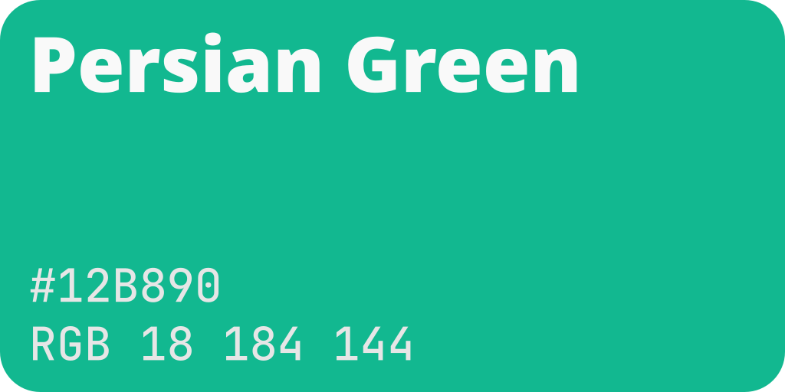

# Aroundy Logo

## License

> [!CAUTION]
> 본 저장소의 브랜드 로고는 Aroundy의 상표이며, Aroundy의 사전 허가 없이 상업적인 용도로 사용할 수 없습니다.
>
> 비상업적인 목적으로 사용될 경우 아래의 브랜드 가이드라인을 반드시 준수해야 하며, 해당 가이드라인을 위반하는 방향으로 수정 및 재배포하는 것을 금지합니다.

[![CC BY-NC-ND 4.0][cc-by-nc-nd-image]][cc-by-nc-nd]

본 저장소의 모든 자산은 [Creative Commons Attribution-NonCommercial-NoDerivs 4.0 International License][cc-by-nc-nd] 에 의해 보호됩니다.

## Colors

| Variant | Common Color Name | Hex       | RGB                 | HSL                  |
| ------- | ----------------- | --------- | ------------------- | -------------------- |
| Primary | Persian Green     | `#12B890` | `rgb(18, 184, 144)` | `hsl(165, 82%, 40%)` |

## Logos

|                    Primary                     |                   Black                    |                   White                    |
| :--------------------------------------------: | :----------------------------------------: | :----------------------------------------: |
|                       |                     |                     |
|        [Primary](./assets/primary.svg)         |        [Black](./assets/black.svg)         |        [White](./assets/white.svg)         |
|                |              |              |
| [Primary, Square](./assets/primary-square.svg) | [Black, Square](./assets/black-square.svg) | [White, Square](./assets/white-square.svg) |
|                |              |              |
| [Primary, Circle](./assets/primary-circle.svg) | [Black, Circle](./assets/black-circle.svg) | [White, Circle](./assets/white-circle.svg) |

[cc-by-nc-nd]: http://creativecommons.org/licenses/by-nc-nd/4.0/
[cc-by-nc-nd-image]: https://licensebuttons.net/l/by-nc-nd/4.0/88x31.png
